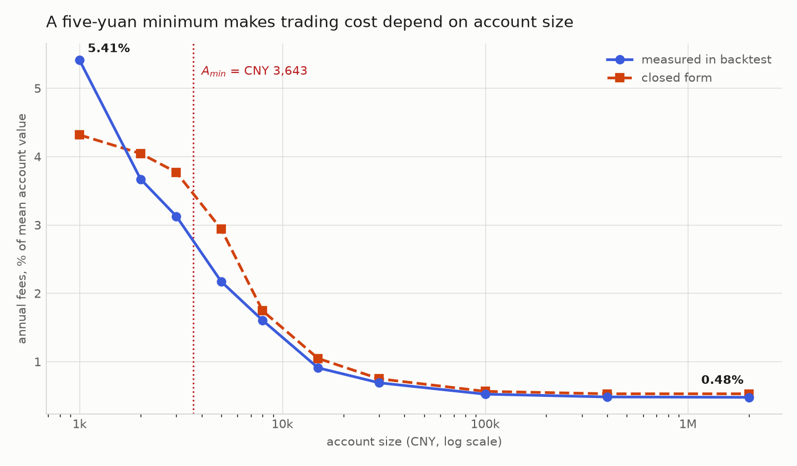
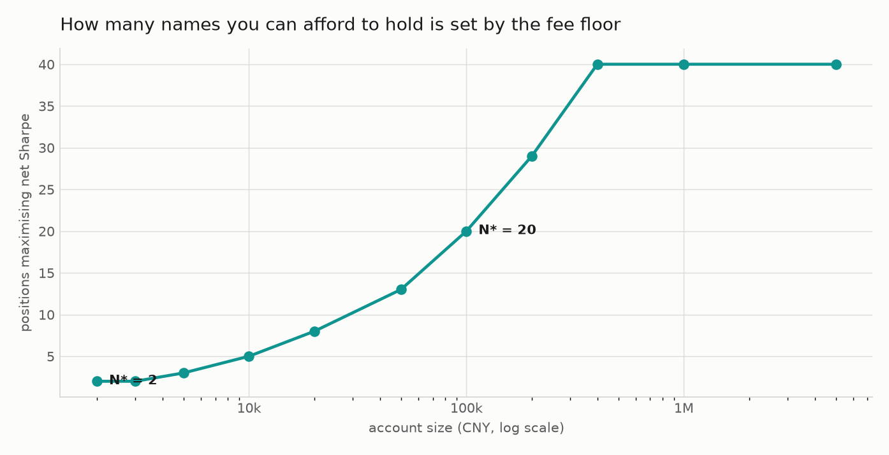
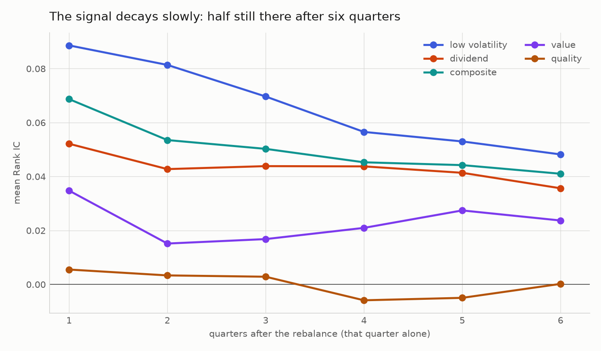
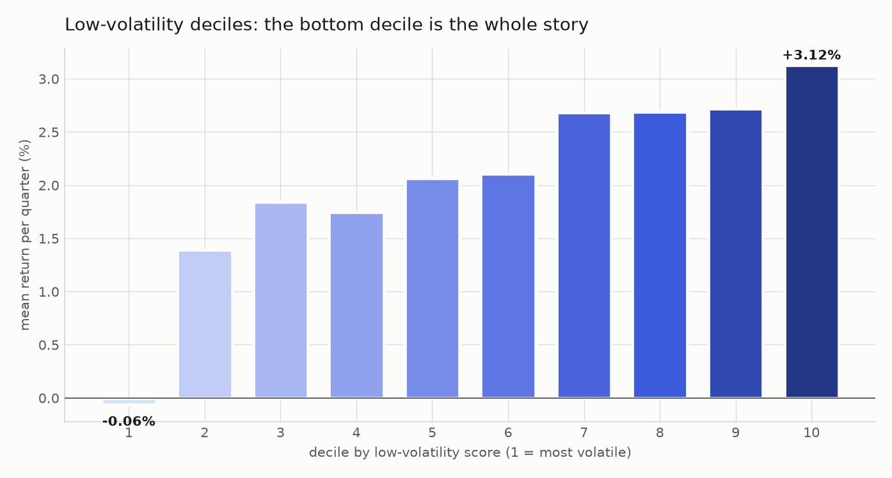

# The Capacity Floor

**The signal works. The portfolio does not. This repository is about the
gap between them, and about a cost structure the literature does not model.**

A four-factor equity signal on 5,492 Chinese A-shares, 2010–2026, point-in-time
throughout. Its low-volatility component has a rank information coefficient of
**0.089** with a Newey–West **t of 6.6** over 64 quarters. A portfolio built on
that signal earns a Sharpe ratio of **0.35** — a **t of 1.4**, which survives no
serious correction.

Those two facts are both true, and the distance between them is the subject.

---

## Where the alpha goes

| | measured | t-statistic |
|---|---|---|
| low-volatility signal, Rank IC | 0.089 | **6.61** |
| composite signal, Rank IC | 0.069 | **5.59** |
| portfolio, Sharpe ratio | 0.348 | **1.38** |

The signal clears the Harvey–Liu–Zhu (*RFS* 2016) `t > 3` bar comfortably. The
portfolio fails even `t > 2`. Nothing was lost in the ranking — it was lost on
the way to the book, and most of it went to the broker.

**Chinese retail brokerage charges 1.5 basis points subject to a CNY 5.00
minimum per trade.** A per-trade minimum is a *fixed* cost. Fixed costs are not
scale-invariant, so as a fraction of capital they behave like `1/A`:

| account (CNY) | 2,000,000 | 400,000 | 100,000 | 30,000 | 15,000 | 8,000 | 3,000 | 2,000 | 1,000 |
|---|---|---|---|---|---|---|---|---|---|
| positions held | 12 | 12 | 12 | 12 | 12 | 11 | 9 | 8 | 3 |
| **annual fees, % of assets** | **0.48%** | 0.48% | 0.52% | 0.69% | 0.91% | 1.60% | 3.13% | 3.67% | **5.41%** |
| closed-form prediction | 0.53% | 0.53% | 0.56% | 0.75% | 1.05% | 1.74% | 3.77% | 4.04% | 4.32% |



**The same strategy pays eleven times the fee rate at one thousand yuan that it
pays at two million.** Where the holding count is stable at 12, the closed form
matches realised fees to within **0.14 percentage points** across four orders of
magnitude. Each account size was run twice — once with costs, once against an
identical zero-cost twin — so the comparison is controlled.

---

## The bound, in closed form

Every serious study of whether a factor survives trading costs — Novy-Marx &
Velikov (*RFS* 2016), Frazzini, Israel & Moskowitz (2018), Detzel, Novy-Marx &
Velikov (*JF* 2023) — models costs as **proportional**, in basis points of
notional. Proportional costs are scale-invariant: double the capital and net
return per unit of capital is unchanged. Under such a model the only thing that
can bound capacity is market impact, which grows with size. Hence capacity is
always reported as a **ceiling**.

A per-trade minimum produces a **floor**:

```
            2 · f · τ · N · F
A_min  =  ─────────────────────────
          g  −  f · τ · (d + 2u + 2s)
```

with `f` rebalances per year, `τ` one-way turnover, `N` positions, `F` the
per-trade floor, `g` gross alpha, and `d, u, s` stamp duty, transfer fee and
slippage. `A_min` is **linear in `N`** and **linear in `f`**, and exists only
when gross alpha survives the proportional costs at all.

Both inputs are measured, not assumed: **`g` = 6.64%** (the strategy re-run with
every cost switched off) and **`τ` = 46.8%** per rebalance, computed with
drifted weights.

`A_min` is linear in `N`, so the bound is really a **per-position**
requirement, and quoting it without saying how many positions it assumes is
meaningless:

```
A_min(N)  =  CNY 303.6  ×  N          ← the whole content of the bound
A_min(12) =  CNY 3,643                ← the familiar number, at 12 positions
```

| | |
|---|---|
| fee requirement per position | **CNY 304** |
| minimum account at 12 positions | CNY 3,643 |
| commission floor stops binding above | CNY 400,000 |
| maximum viable account `A_max` (10% of ADV) | CNY 229,000,000 |

### There is a second floor, and it usually binds harder

A-shares trade in **lots of 100 shares**. One position costs `100 × price`
whether or not you want that much of it. That is a separate requirement on
capital per position, and the real minimum is `N ×` whichever is larger:

| | fee floor | lot floor |
|---|---|---|
| nature | economic — the trade clears, you lose money on it | mechanical — the broker rejects the order |
| visible without measuring? | no | yes |
| constrains | whether holding `N` positions is **worth it** | whether holding `N` positions is **possible** |
| for this strategy | CNY 304 / position | CNY 250 – 2,500 / position |

What the backtest actually did at each account size:

| account (CNY) | positions held | capital per position | binding |
|---|---|---|---|
| 1,000 | 3 | 333 | lot |
| 2,000 | 8 | **250** | **fee** — eight positions too small to pay for themselves |
| 3,000 | 9 | 333 | lot |
| 5,000 | 11 | 455 | lot |
| 8,000 | 11 | 727 | lot |
| 15,000 | 12 | 1,250 | the 12-position cap |

**So the lot constraint binds more often than the fee floor does**, and the
practical minimum for running this strategy as designed is not CNY 3,643 but
about **CNY 15,000** — the point at which the lot constraint stops limiting
the book.

That does not make the fee floor a by-product of lot sizes, and the US case
is what separates them: US retail has **no** lot constraint (fractional
shares are routine) but did carry a $4.95 per-trade commission until October
2019 — a fee floor with no lot floor, which then disappeared. A-shares
happen to carry both at once, which is exactly why they are easy to conflate
there.

Full derivation, the market-impact upper bound and the optimal-`N` trade-off:
**[docs/02-capacity-framework.md](docs/02-capacity-framework.md)**

### Diversification is not free



At the measured `g` and `τ`, the number of positions that maximises net Sharpe
is **2 at CNY 2,000** and **40 at CNY 400,000**. Remove the per-trade floor and
this dependence on account size vanishes entirely — `N*` becomes independent of
`A`. That is asserted as a unit test, because it is the mechanism.

---

## The cross-market control

The cleanest test of the mechanism is not another market; it is the same market
before and after a change in the shape of the cost function. In **October 2019**
Schwab, TD Ameritrade, E\*TRADE and Fidelity moved US retail commission to zero
within days of each other. Before that, a representative online broker charged
about **$4.95 flat per trade** — structurally identical to the CNY 5 floor.

Same signal, same turnover, same 12 positions. Only the cost function changes:

| cost regime | per-trade floor | fee requirement per position | `A_min` at N = 12 |
|---|---|---|---|
| A-share retail | CNY 5.00 | CNY 304 | **CNY 3,643** |
| US retail, pre-Oct-2019 | $4.95 | $296 | **$3,554** |
| US retail, post-Oct-2019 | $0.00 | **$0** | **none — the bound does not exist** |

The near-equality of the first two rows is incidental; the floors happen to be
similar in size. The point is the third row, and that it is a *structural*
difference rather than one of degree.

---

## What the signal actually looks like



Two horizon curves are reported, because conflating them is easy and
consequential. The **marginal** Rank IC — quarter `h` on its own — is the one
that decays, and it decays slowly: low volatility retains **54%** of its
first-quarter IC six quarters later, dividend **68%**, the composite **60%**.
The **cumulative** IC against the return from the rebalance date to `h` quarters
out rises monotonically, which is what persistence looks like and is *not* a
claim that the signal strengthens with age.



Sorted-portfolio results at J = 10, per quarter:

| factor | Rank IC | ICIR (ann.) | t (NW) | decile spread p.a. | Patton–Timmermann |
|---|---|---|---|---|---|
| **low volatility** | 0.0886 | 1.56 | **6.61** | **13.4%** | p = 0.007, 1 of 9 steps inverted |
| dividend | 0.0521 | 1.31 | **4.49** | 6.3% | p = 0.59 |
| composite | 0.0687 | 1.36 | **5.59** | 7.2% | p = 0.002, 2 of 9 inverted |
| value | 0.0348 | 0.61 | 2.77 | 1.2% | p = 0.88 |
| **quality** | 0.0055 | 0.12 | **0.49** | 1.7% | p = 0.20 |

Three findings worth stating plainly:

**The bottom decile is most of the effect.** Low-volatility decile means run
−0.06%, 1.39%, 1.84%, … 3.12% per quarter. The single step from decile 1 to
decile 2 is 1.45pp of the 3.18pp total spread — **46% of the signal comes from
not owning the most volatile tenth of the market.** For a retail investor that is
an exclusion rule, not a ranking problem, and exclusion rules are cheap.

**The quality factor is noise.** `t = 0.49`, hit rate 49.2%, and its marginal IC
turns negative by quarter four. It nonetheless carries a quarter of the weight in
the equal-weighted composite.

**The finer partition does not replicate.** At J = 20 nothing clears the
monotonicity test. Cattaneo, Crump, Farrell & Schaumburg (*REStat* 2020) argue
the universal choice of deciles is arbitrary; reporting both is the honest
response, and the honest reading is that 64 quarters is thin for 20 buckets.

**[docs/05-factor-evidence.md](docs/05-factor-evidence.md)**

---

## What I did not do, and why

The obvious move after seeing `t = 0.49` is to drop the quality factor and
re-weight. **I did not.** The configuration was frozen on 2026-09-24 with a
declared out-of-sample window, and the quality result was measured on the same
sample that would justify removing it. Re-weighting now would be fitting to the
data twice and then reporting the second fit as a discovery.

It is instead registered in `research/trials.json` as **trial 27**, to be
evaluated on the frozen holdout. The count of registered trials is an input to
the multiple-testing corrections below, so adding one has a cost — which is the
point of keeping the register.

---

## The strategy does not survive multiple testing, and that is reported first

| full sample, 2011-01 → 2026-09 (15.6y) | strategy | CSI 300 |
|---|---|---|
| CAGR | 4.67% | 2.44% |
| max drawdown | −47.6% | −46.7% |
| annual Sharpe | **0.348** | — |

* Implied `t` = 0.348 × √15.62 = **1.38**. Fails `t > 2`; fails HLZ `t > 3`.
* Against the **26 registered trials**, the Harvey & Liu (*JPM* 2015) haircut
  removes **100%** of the Sharpe.
* Deflated Sharpe Ratio (Bailey & López de Prado 2014): **0.26** against 26
  trials, **0.06** against a literature-scale test count.
* Declared 3-year holdout: **−3.33pp** annual excess, against +2.23pp in sample.

**But the ranking is not noise.** Re-running the identical rules with *random*
selection from the same eligible pool, 40 times, gives a median CAGR of
**−4.13%** against the ranked strategy's **+4.67%** — above all 40 draws.

So: the signal has information (t = 6.6), the ranking beats random by 8.8pp a
year, and the portfolio still fails. Those are consistent, and the capacity
analysis is why.

**[docs/03-what-does-not-work.md](docs/03-what-does-not-work.md)**

---

## A prediction this makes, and how to falsify it

`A_min` is linear in rebalance frequency `f`. The marginal IC says the signal
still has 54–68% of its strength six quarters out. Together these say quarterly
rebalancing is over-trading a slow signal, and that moving to annual rebalancing
should cut the minimum viable account substantially.

At annual rebalancing, with annual turnover `τ₁` (higher than quarterly because
weights drift longer):

| assumed `τ₁` | predicted `A_min` |
|---|---|
| 0.70 | CNY 1,300 |
| 0.80 | CNY 1,491 |
| 0.90 | CNY 1,684 |
| 1.00 | CNY 1,879 |

**Prediction: `A_min` falls below CNY 2,000 for any `τ₁ ≤ 1.0`.** The test is one
line — set `调仓频率` to `"年"` in `config.json` and re-run
`research/capacity.py`, which measures `τ₁` rather than assuming it. This is
stated before running it, so it can fail.

---

## Data integrity

**`ann_date` is not the first-disclosure date.** Median gap between
`report_date` and the vendor's announcement date: **396 days**, against 101 days
for the dividend table's `plan_ann_date`. The field is the date of the *most
recent* filing mentioning the period. This creates no look-ahead — it does the
opposite, and would have computed every quality factor from fundamentals more
than a year stale. Fixed with `min(ann_date, statutory deadline)`, bounded below
by the period end.

**A destructive look-ahead test, not an argument.** Every price, volume and
financial record at or after a rebalance date was corrupted — 6,546 future
financial records overwritten — and the factors recomputed. All eleven factor
values were bit-identical.

**A bug found by a property test.** An assertion that no report can become usable
before the period it describes has ended failed on a generated `ann_date` of
2009-11-11 against the 2010 annual report, which is a genuine look-ahead path.
Corrupt dates earlier than the period end are now discarded.

**Three alarming numbers in a US control sample were all my own query scopes** —
a delisting-return denominator that included securities CRSP flags as still
trading, and a universe count with no share-code or exchange filter that was
picking up ETFs, ADRs, REITs and SPACs. Figures omitted: that data is licensed.

**[docs/01-data-integrity.md](docs/01-data-integrity.md)**

---

## Layout

```
research/
  cost_model.py      analytic capacity model; no I/O, no data dependency
  capacity.py        empirical estimation: gross run, AUM grid, bounds
  factor_eval.py     IC, Rank IC, ICIR, marginal + cumulative horizon, deciles
  stat_honesty.py    haircut Sharpe, Deflated Sharpe, PBO, trial registry
  stats_tools.py     Newey-West, DSR, Harvey-Liu, Patton-Timmermann, CSCV
  signals.py         cached point-in-time signal panel
  make_charts.py     every figure, from results/*.json alone
  trials.json        every configuration evaluated, and the OOS freeze
tests/               63 tests, numpy + pandas only
docs/                the five chapters
code/                the A-share tool: database build, engine, backtest,
                     screener, control panel (Chinese UI — its users are
                     Chinese retail investors)
results/             generated aggregates and figures (no market data)
```

## Reproducing

```bash
pip install -r requirements.txt
python tests/run_tests.py            # 63 tests, ~3s, no database needed
python research/make_charts.py       # all figures, ~1s, from JSON
python research/capacity.py          # needs the database; ~90 min
python research/factor_eval.py       # ~15 min first run, ~1 min cached
python research/stat_honesty.py --pbo
```

`research/cost_model.py` and the whole test suite run on numpy and pandas alone,
so every claim in the closed-form section is verifiable without downloading any
market data. The A-share database is built from free public sources (Baostock,
AKShare) by `code/build_db.py`.

**No market data is committed to this repository.** CRSP and Compustat are
licensed through an institutional subscription, and this repository applies a
stricter rule than the licence requires: no record-level extract, and no
WRDS-derived figures either. Rationale:
[docs/01 §1.5](docs/01-data-integrity.md#15-redistribution-constraint).

---

## Method notes a reviewer would check

* **Turnover uses drifted weights**, `w⁻ = w_{t-1}(1+r_i)/(1+r_p)`. I expected
  the undrifted figure to overstate turnover; on this strategy it does the
  opposite — 45.2% against 46.8% — because for an equal-weighted book the drift
  is what creates the rebalancing trades. The direction is a property of the
  weighting scheme, which is the reason to measure it rather than assert it.
* **Rank IC is computed without scipy**, as Pearson on average ranks after
  pairwise deletion. Ranking before deletion gives a different answer; the order
  is asserted in a test because with complete inputs the bug is invisible.
* **Newey–West throughout.** Horizon-`h` ICs measured every rebalance overlap by
  `h−1` periods, so the naive `t` is inflated by roughly `√h`.
* **Monotonicity is tested**, not eyeballed — Patton & Timmermann (*JFE* 2010) —
  and the verdict reports flatness-rejection and strict monotonicity separately,
  because collapsing them once printed a decisive result as a negative one.
* **Kurtosis passed to the DSR is non-excess.** `scipy.stats.kurtosis` returns
  excess by default and silently inflates the result.
* **Universe excludes the smallest 30% by float market cap**, following Liu,
  Stambaugh & Yuan (*JFE* 2019) on shell-value contamination, and uses EP rather
  than book-to-market for the same reason.
* **Execution models T+1, price limits** (±10% main board, ±20% ChiNext/STAR,
  ±5% → ±10% for main-board ST from 2026-07-06), **suspensions, one-price limit
  days and 100-share lots.**

Everything the project cannot do is in
**[docs/04-limitations.md](docs/04-limitations.md)**, stated specifically.

---

## References

Bailey & López de Prado (2014), *The Deflated Sharpe Ratio*, JPM.
Bailey, Borwein, López de Prado & Zhu (2017), *The Probability of Backtest Overfitting*, J. Comput. Finance.
Cattaneo, Crump, Farrell & Schaumburg (2020), *Characteristic-Sorted Portfolios*, REStat.
Detzel, Novy-Marx & Velikov (2023), *Model Comparison with Transaction Costs*, JF.
Elton & Gruber (1977), *Risk Reduction and Portfolio Size*, J. Business.
Harvey & Liu (2015), *Backtesting*, JPM.
Harvey, Liu & Zhu (2016), *… and the Cross-Section of Expected Returns*, RFS.
Liu, Stambaugh & Yuan (2019), *Size and Value in China*, JFE.
Novy-Marx & Velikov (2016), *A Taxonomy of Anomalies and Their Trading Costs*, RFS.
Patton & Timmermann (2010), *Monotonicity in Asset Returns*, JFE.
Qian, Hua & Sorensen (2007), *Quantitative Equity Portfolio Management*.

---

## License and provenance

Code is MIT (`LICENSE`). Market data is not redistributed.

This project was developed with AI assistance (Claude) for implementation and
literature search. The research question, every design decision, and every claim
in this README are mine, and I can derive, defend or re-run any of them.
